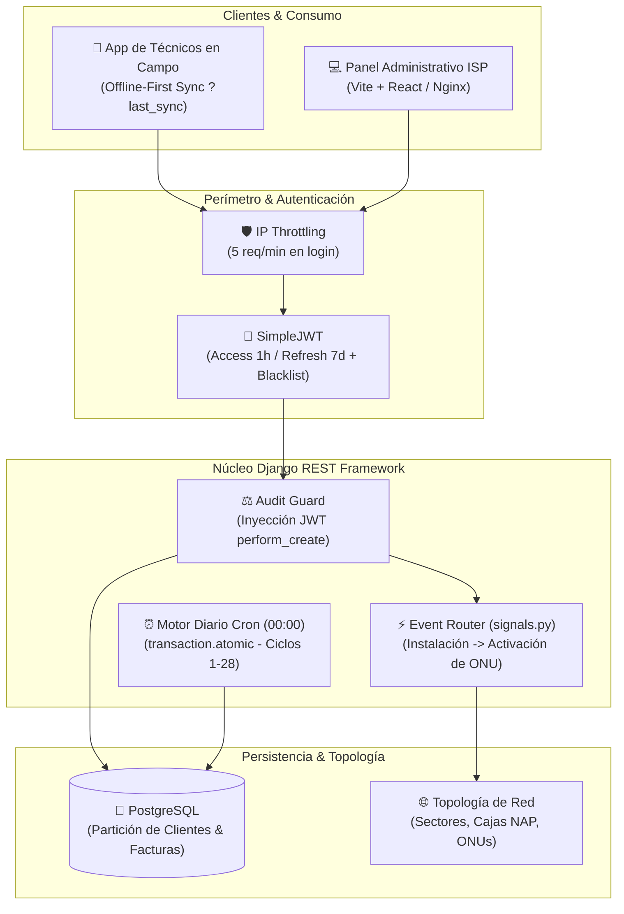
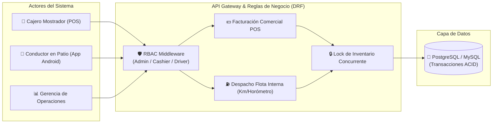

# 👋 Hola, soy Jyndev
### **Backend & Systems Engineer**
**Python • Django / DRF • PostgreSQL • Arquitecturas Transaccionales • Docker & Linux**

  <a href="https://github.com/Jyndev">GitHub</a> •
  <a href="mailto:jyndev@gmail.com">Contacto</a> •
  📍 Cúcuta, Colombia (Disponible Remoto / Híbrido)

---

## ⚡ Resumen Ejecutivo (Lectura en 15 Segundos)

Soy un **Desarrollador Backend** enfocado en diseñar y poner en producción **sistemas transaccionales de alta confiabilidad, arquitecturas offline-first, motores de facturación automatizada y despliegues contenerizados**. 

* 🚀 **3+ años desarrollando y manteniendo software comercial en producción real.**
* 🛡️ **Tolerancia Cero a Desfases:** Motores de facturación mensual para telecomunicaciones y sistemas POS con cálculo inmutable de divisas y transacciones atómicas (`transaction.atomic`).
* 📡 **Arquitecturas Offline-First:** Sincronización delta incremental para cuadrillas técnicas y clientes móviles en condiciones de conectividad inestable.
* 📦 **DevOps & Entornos:** Despliegue orquestado con Docker, Gunicorn, Nginx, cronjobs de mantenimiento y compilación nativa en entornos Linux.
* 🌟 **Comunidad & Open Source:** **+95 estrellas** en GitHub por herramientas de automatización de sistema y desarrollo nativo en Unix.

---

## 🛠️ Stack Tecnológico & Dominio Técnico

| Capa | Tecnologías | Enfoque de Producción |
| :--- | :--- | :--- |
| **Backend Core** | `Python 3`, `Django 4.x / 6.x`, `Django REST Framework` | Clean Architecture, ViewSets, Serializers relacionales, Throttling por IP. |
| **Bases de Datos** | `PostgreSQL`, `MySQL`, `SQLite` | Diseño relacional normalizado, restricciones de integridad, transacciones ACID. |
| **Seguridad & Auth** | `SimpleJWT`, `RBAC (Role-Based Access)` | Stateless Auth, rotación de refresh tokens, lista negra automática, inyección de auditoría. |
| **DevOps & SysAdmin** | `Docker`, `Docker Compose`, `Gunicorn`, `Nginx`, `Linux (Arch/Debian)` | Contenerización multi-etapa, cronjobs de mantenimiento, scripts Bash para automatización. |
| **Integraciones & Frontend** | `React Native (Expo)`, `Vite`, `Google Gemini SDK`, `PySide6 (Qt)` | Consumo de APIs REST, validación de esquemas Pydantic, herramientas de escritorio. |

---

## 🏛️ Estudios de Caso Sanitizados (Experiencia en Producción)

> *Nota de confidencialidad: De acuerdo con las mejores prácticas y acuerdos de confidencialidad (NDA), las identidades y credenciales de clientes se encuentran sanitizadas. Los diagramas, especificaciones técnicas y patrones arquitectónicos presentados corresponden a sistemas comerciales actualmente en producción.*

---

### 1. RiverNet Core — Motor de Operaciones & Facturación Automatizada para ISPs
**Dominio:** Telecomunicaciones & Gestión de Proveedores de Internet (ISP)  
**Stack:** `Python 3.12+` • `Django 6.0` • `Django REST Framework` • `PostgreSQL` • `SimpleJWT` • `Gunicorn` • `Docker` • `Vite / Tailwind`

#### El Desafío
Un ISP regional requería centralizar la administración de su infraestructura de fibra (ONUs, cajas NAP, sectores geográficos), gestionar órdenes de servicio en campo con cobertura móvil irregular y erradicar errores humanos en la facturación mensual recurrente y el cobro multimoneda.

#### Solución Arquitectónica
* **Sincronización Offline-First Incremental:** Implementación de endpoints transaccionales (`/api/clientes/`, `/api/ordenes-servicio/`) con soporte de sincronización delta mediante el parámetro `?last_sync=<timestamp>`, permitiendo a técnicos de campo operar desconectados y sincronizar exclusivamente las modificaciones al retomar señal.
* **Auditoría Forzada e Inmutabilidad Financiera:**
  * Herencia de un `BaseModel` que inyecta automáticamente `creado_por` y `modificado_por` en `perform_create` y `perform_update` extrayendo la identidad criptográfica del token JWT.
  * Los campos contables (`monto_convertido_usd`) en el registro de abonos son **estrictamente de solo lectura** para el cliente: el backend realiza la conversión de moneda de forma aislada e inmutable.
* **Orquestación Desacoplada por Señales (Event-Driven):**
  * Disparadores en `signals.py` con *lazy imports* (`apps.get_model()`) para evitar dependencias circulares entre módulos.
  * Al pasar una orden de instalación a estado `Solucionado`, se activa automáticamente el activo de red asignando `fecha_instalacion` y `dia_facturacion = min(now.day, 28)`.
  * Generación de factura de instalación con protección de idempotencia de 24 horas mediante comprobaciones `.exists()`.
* **Automatización de Mensualidades (Cronjob + Django Management Command):**
  * Comando personalizado `python manage.py generar_facturas` ejecutado diariamente a la medianoche por un cronjob Linux.
  * Ciclo de corte restringido (días 1 a 28) envuelto en bloques `transaction.atomic()`, garantizando consistencia absoluta ante fallos eléctricos o caídas del proceso.

#### Diagrama de Arquitectura

---

### 2. Mundo Diesel V2 — POS Industrial, Despacho de Combustible & Control de Flotas
**Dominio:** Logística de Transporte Pesado & Estación de Servicio Industrial  
**Stack:** `Django 4.2 / DRF` • `PostgreSQL / MySQL` • `Docker` • `Nixpacks` • `Gunicorn` • `React Native (Expo / EAS)`

#### El Desafío
Coordinar en tiempo real el despacho masivo de combustible diésel para maquinaria pesada propia frente a la venta minorista en mostrador POS, manteniendo control estricto de inventarios concurrentes y asignación de consumo por conductor/vehículo.

#### Solución Arquitectónica
* **Seguridad RBAC Stateless:** Arquitectura de roles diferenciados (`ADMIN`, `CASHIER`, `DRIVER`) controlando scopes estrictos de acceso a endpoints de facturación vs. despacho interno.
* **Doble Libro de Inventario con Bloqueo Concurrente:** Mecanismo transaccional que previene condiciones de carrera al descontar inventario simultáneamente entre ventas de mostrador y despachos a cisternas de carga.
* **Cliente Móvil Dedicado:** Aplicación móvil en React Native (TypeScript + Expo) compilada para dispositivos Android en patio, con captura de kilometraje, firma de comprobantes y almacenamiento seguro de sesión.
* **Contenerización Reproducible:** Configuración con `Dockerfile`, perfiles de `nixpacks.toml` y orquestación con Gunicorn y Whitenoise.

#### Diagrama de Arquitectura

---

### 3. Transportes Cachaco — Reingeniería Logística & Document Pipeline con IA
**Dominio:** Transporte Nacional de Carga Pesada  
**Stack:** `Django 6.0` • `MySQL / PostgreSQL` • `Google Gemini GenAI SDK` • `Pydantic` • `Gunicorn` • `Whitenoise`

#### El Desafío
Modernizar una plataforma operativa monolítica legacy en PHP procedural que procesaba cientos de despachos de carga semanales, haciéndola escalable y reduciendo el tiempo de digitación manual de manifiestos y remesas.

#### Solución Arquitectónica
* **Migración & Normalización de Datos:** Reingeniería inversa de esquemas legacy a modelos normalizados en Django ORM sin interrumpir la operación comercial continua.
* **Pipeline Asistido por Inteligencia Artificial:** Integración de la API de Google Gemini estructurada mediante esquemas estrictos de **Pydantic** para validar y clasificar manifiestos de transporte, extrayendo pesos, destinos y tarifas automáticamente.
* **Servidor & Despliegue Híbrido:** Compatibilidad con entornos Linux bajo Gunicorn y despliegues locales controlados mediante scripts de inicialización de servidor (`.bat` / Bash).

---

## 🚀 Proyectos Públicos & Ecosistema Open Source

<table width="100%">
  <tr>
    <td width="50%" valign="top">
      <h3>⚙️ <a href="https://github.com/Jyndev/GearCloud">GearCloud</a></h3>
      
<strong>Gestión Integral de Talleres Mecánicos y Flotas</strong>

      <ul>
        <li>Desarrollado bajo el marco del programa Tecnólogo ADSO (SENA).</li>
        <li>Backend robusto en <code>Django 6.0</code> con roles diferenciados (<code>ADMIN</code>, <code>RECEPCIÓN</code>, <code>MECÁNICO</code>).</li>
        <li>Control de historiales técnicos vehiculares asociados por placa y normalización automática de documentos.</li>
        <li>Interfaz moderna con Bootstrap 5.3, micro-animaciones y variables CSS personalizadas.</li>
      </ul>
      
<code>Python</code> • <code>Django 6</code> • <code>Bootstrap 5</code> • <code>PostgreSQL</code>

    </td>
    <td width="50%" valign="top">
      <h3>📱 <a href="https://github.com/Jyndev/JynDo">JynDo</a></h3>
      
<strong>App Móvil de Productividad Gamificada (Offline-First)</strong>

      <ul>
        <li>Diseñada con enfoque en rendimiento, consumo mínimo de memoria y almacenamiento local con <code>SQLite</code>.</li>
        <li><strong>Pipeline de Compilación Nativo:</strong> Configurada para construirse 100% de forma local en <strong>Arch Linux</strong> mediante Gradle y CLI tools de Android, prescindiendo del peso de Android Studio.</li>
        <li>Sistema de progresión dinámico con experiencia (XP) y UI minimalista estilo terminal.</li>
      </ul>
      
<code>React Native</code> • <code>Expo</code> • <code>SQLite</code> • <code>Arch Linux / Android SDK</code>

    </td>
  </tr>
  <tr>
    <td width="50%" valign="top">
      <h3>🌌 <a href="https://github.com/Jyndev/FondosApp">FondosApp</a></h3>
      
<strong>Wallpaper & Theme Engine para Linux Hyprland</strong>

      <ul>
        <li>Aplicación de escritorio en <code>PySide6 (Qt)</code> con sincronización de paletas dinámicas basadas en <strong>Material You</strong> (<code>Matugen</code>).</li>
        <li>Integración IPC en tiempo real con <strong>AGS (Aylur's GTK Shell)</strong> para hot-reload de temas en el entorno de ventanas.</li>
        <li>Empaquetado a binario nativo independiente con <code>PyInstaller</code>.</li>
      </ul>
      
<code>Python</code> • <code>PySide6</code> • <code>Linux IPC</code> • <code>Wayland</code>

    </td>
    <td width="50%" valign="top">
      <h3>🐧 <a href="https://github.com/Jyndev/dotfiles_v2">dotfiles_v2</a> & <a href="https://github.com/Jyndev/AiDots">AiDots</a> (+90 ⭐)</h3>
      
<strong>Entorno de Trabajo & Automatización Unix</strong>

      <ul>
        <li>Ecosistema de configuración modular para Arch Linux y Hyprland con scripts de automatización de alto rendimiento.</li>
        <li>Ampliamente reconocido en la comunidad de entusiastas de Linux con más de 90 estrellas acumuladas en GitHub.</li>
      </ul>
      
<code>Shell / Bash</code> • <code>Hyprland</code> • <code>Linux Architecture</code>

    </td>
  </tr>
</table>

---

## 🧠 Filosofía & Estándares de Ingeniería Backend

1. **La Verdad Reside Exclusivamente en el Servidor:** El cliente (frontend o móvil) es inherentemente inseguro. Las matemáticas financieras, conversiones de tasa de cambio y cálculos de stock se resuelven de forma inmutable en el backend.
2. **Idempotencia Transaccional:** Toda mutación de saldo o inventario se ejecuta dentro de bloques atómicos (`transaction.atomic`). Si una llamada de red falla a la mitad, la base de datos revierte al estado consistente anterior.
3. **Auditoría No Negociable:** Los registros críticos capturan automáticamente el usuario autenticado desde el token criptográfico JWT, eliminando la posibilidad de falsificación de autoría.
4. **Desacoplamiento Event-Driven:** Uso riguroso de señales con importaciones perezosas para desacoplar módulos de dominio y prevenir ciclos de importación.
5. **Pragmatismo DevOps:** Código estructurado según los principios de los 12 Factores: configuración aislada en variables de entorno, contenedores reproducibles y comandos de mantenimiento auditables.

---

### 📬 ¿Buscando un Ingeniero Backend que resuelva problemas reales en producción?

**Conectemos:** [jyndev@gmail.com](mailto:jyndev@gmail.com) • [GitHub Profile](https://github.com/Jyndev)

*© 2026 Jyndev. Construyendo sistemas confiables línea por línea.*

